<!--
  This is the PROFILE README for github.com/rohitraj24-SE/rohitraj24-SE, so it
  renders on the profile page. Widths 370/490 keep the portrait and info card
  the same height -- if you change the info card's H, re-match these.
-->

<table>
<tr>
<td valign="top"></td>
<td valign="top"></td>
</tr>
</table>

## Rohit Raj

**Software Developer · Aspiring Backend & Full Stack Developer · AI & Cloud Enthusiast**

 

<!-- animated contribution graph, refreshed daily by the workflow -->

